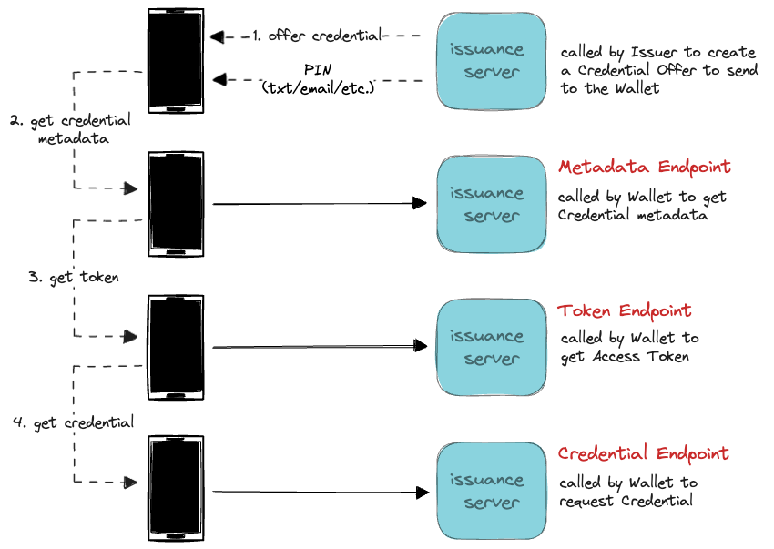
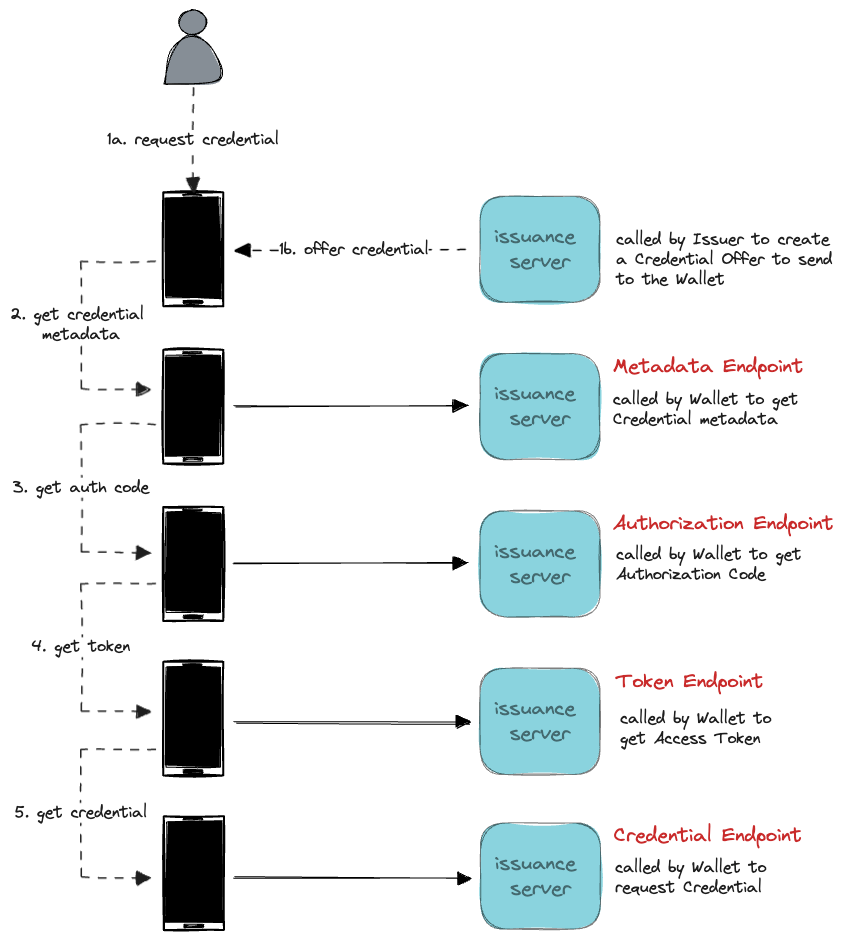

# Issuance

Based on the [OpenID for Verifiable Credential Issuance](https://openid.net/specs/openid-4-verifiable-credential-issuance-1_0.html)
specification, the [vercre-vci](https://github.com/vercre/vercre/tree/main/vercre-vci) 
library provides an API for issuing Verifiable Credentials.

The specification defines an API for Credential issuance provided by a Credential Issuer. 

The API is comprised of the a set of endpoints, called in sequence to issue a Credential.
The sequence is determined both by the flow used to initiate the issuance process as well
as such things as whether the issuer defers Credential issuance. 

## Pre-Authorized Code Flow

The Pre-Authorized Code flow is initiated by the Issuer, who creates a Credential Offer
that includes a Pre-Authorized Code. The Offer is "sent" to the Wallet, either directly 
or by the End-User scanning a QR code or similar.

Currently, we consider this the most common way of initiating Credential issuance and, 
as a consequence, have invested more in its implementation and ergonimics.

In this flow, the Wallet exchanges the Pre-Authorized Code for an Access Token at the 
Token Endpoint. The Access Token is then used to request Credential issuance at the 
Credential Endpoint.

Prior to initiating this flow, the Issuer prepares by authenticating and authorizing the
End-User.

<figure style="text-align:center;padding-top:1.5rem;">
  
    <figcaption>Pre-Authorized Code Flow</figcaption>
</figure>

## Authorization Code Flow

The Authorization Code flow can be initiated initiated by either the Issuer making a 
Credential Offer (without a Pre-Authized Code) or the End-User requesting a Credential.
In either case, the End-User is unauthorized and must authenticate and authorize before
the Credential can issued.

In this case, the Wallet must call the Authorization Endpoint to authorize the End-User.
Following authorization, the Wallet exchanges the Authorization Code for an Access Token
and the flow continues from Token Endpoint to Credential Endpoint as above.

<figure style="text-align:center;padding-top:1.5rem;">
  
    <figcaption>Authorization Code Flow</figcaption>
</figure>

[OpenID for Verifiable Credential Issuance]: https://openid.net/specs/openid-4-verifiable-credential-issuance-1_0.html