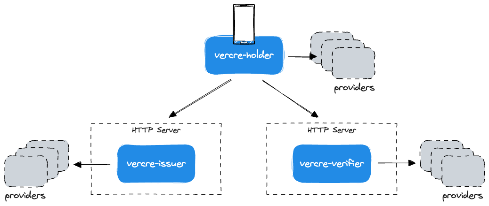

# Architecture

At its most simple, Vercre is a set of three top-level libraries that support 
developers in building Verifiable Credential-based applications. That is, applications
that can issue, present, and verify credentials — all underpinned by OpenID for 
Verifiable Credential specifications.

Users bring their own HTTP server(s) and implement provider traits for each library.

## Issuer-Holder-Verifier

Vercre is modelled around the _Issuer-Holder-Verifier_ model — a means of exchanging 
Verifiable Credential claims, where claim issuance is independent of the process of 
presenting them to Verifiers.

Each top-level library maps to one of the model's three components:

- [vercre-issuer](../using/issuance/index.md) to the _Issuer_
- [vercre-verifier](../using/presentation/index.md) to the _Verifier_
- [vercre-holder](../using/wallet/index.md) to the _Holder_.

## Providers

Each library has a numer of provider traits that users must implement to use the 
library. Providers allow users to customize the behavior of the library to their 
needs by bringing their own persistence, state management, secure signing, etc..

We'll cover providers in more depth in the user guides for each library.