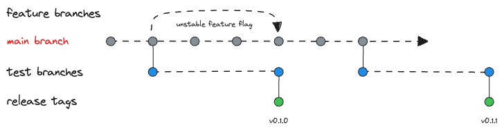

# Releasing Updates

## Overview

Overall, the Vercre's release process favours bringing new features to market frequently, while minimizing the risk of releasing a broken version. It draws heavily on the Rust release process, which is well-documented and understood.



## Core tenets

The release process starts as soon as a change is identified. That is, the decision to release is not a separate step at the end of development, but rather a natural consequence of bringing a change to market.

**TLDR**:

* `main` is the source of truth. 
* Development is undertaken on `feature` branches and is considered complete when requirements have been met and CI checks pass. 
* Completed features are merged back into `main`, gated behind a "feature flag".
* A short-lived `release` branch is created for testing and release preparation with any changes merged back into `main`.
* Once ready, a release is tagged, published, and the branch deleted.

### `main` branch

The `main` branch is the source of truth. It should always be in a releasable state, and is the basis for all development. While new development is undertaken on `feature` branches, changes should be merged as soon as practicable, protected behind a temporary feature flag for the change.

### Feature branches

Development is undertaken on `feature` branches. Branches should be as short-lived as possible, and are deleted once the change is merged back into `main`.

If possible, larger changes should be broken down into smaller, more manageable changes, and developed on separate branches.

Every feature change should be added to the manually curated CHANGELOG.md for the relevant crate.

### Publishing a release

The publishing process is initiated by creating a new, short-lived, `release` branch from `main`. The branch should be named for the release version, e.g. `release-v0.2.0`.

Create a new branch from `main` and check out:

```sh
git checkout -b release-v0.2.0
```

The new version number can be determined by running a a semver check on the codebase to establish the whether this is a major, minor, or patch release.

```sh
cargo make semver
```

Comprehensive integration testing is undertaken on this branch, with any changes merged back into `main`. Once the release is ready, the code is tagged, published, and the branch deleted.

Create release tag and push the branch and tag to the remote repository:

```sh
git tag v0.2.0 -m "v0.2.0 release"

# push new branch
git push --set-upstream origin release-v0.2.0
git push --tags
```

TODO: Add a section on how to create a release on Github.

```
cargo make release minor
```

### Changelog

All notable changes should be documented in the project's CHANGELOG.md file.
Per [Keep a Changelog](https://keepachangelog.com/en/1.0.0/) recommendations, changes are a manually
documented, high-level summary of changes in a release.

### Dry run

Set the release level using one of `release`, `major`, `minor`, `patch`, `alpha`, `beta`, `rc`

For example, to release a minor version:

```sh
cargo make release minor
```

### Publish

Release to crates.io:

```sh
cargo make publish minor
```

<!-- 
### [TO REVIEW] Github Release

In order to track changes to each crate independently, we need a branch containing only the contents of the crate we want to release:

Manually:

1. Create a new branch (use crate name).
2. Delete all files and folders except the crate to release.
3. Push the new branch
4. Use Github to create a release **on the new branch**

CLI:

```sh
# create a new branch from `main` and check out
git checkout -b release-v0.2.0

# delete all files and folders except the crate to release

# stage and commit changes
git add . 
git  commit -a -m "release-v0.2.0"

# tag the branch
git tag v0.2.0 -m "v0.2.0 release"

# push new branch
git push --set-upstream origin release-v0.2.0
git push --tags
``` -->
