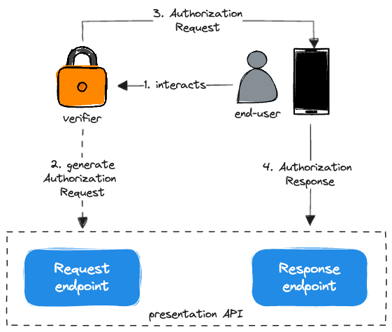
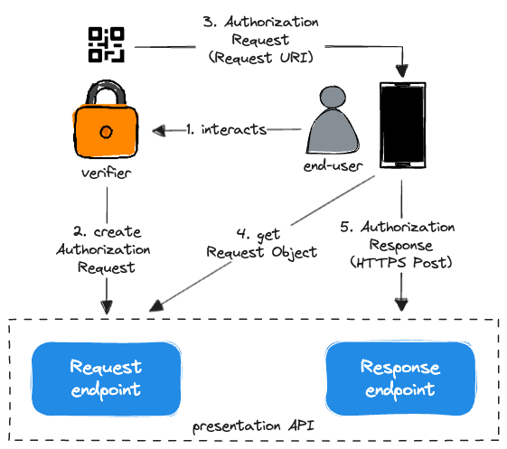

# Verifier

Based on the [OpenID for Verifiable Presentations](https://openid.net/specs/openid-4-verifiable-presentations-1_0.html)
specification, the [vercre-vp](https://github.com/vercre/vercre/tree/main/vercre-vp) 
library provides an API for requesting and presenting Verifiable Credentials. 

The API is comprised of the a set of endpoints, called in sequence to request 
presentation of one or more Credentials. While the end result is the same, the sequence
varies depending on whether the presentation request is made from the same device as the
Wallet (Same-Device Flow)  or from a different device (Cross-Device Flow).

## Same-Device Flow

Being initiated on the same device as the Wallet, this flow can use simple redirects to
pass the Authorization Request and Response objects between the Verifier and the Wallet. 
Verifiable Presentations are returned to the Verifier in the fragment part of the 
redirect URI, when Response Mode is fragment.

<figure style="text-align:center;padding-top:1.5rem;">
  
    <figcaption>Same-Device Flow</figcaption>
</figure>

## Cross-Device Flow

The Verifier generates an Authorization Request and renders it as a QR code. The
End-User then uses the Wallet to scan the QR Code and initiate authorization. The 
Wallet retrieves the Authorization Request object from the URL referenced in the QR 
code, processing the contained Presentation Definition.

Once authorized, the Wallet send the resulting Verifiable Presentations directly to the
Verifier (using HTTPS POST).

<figure style="text-align:center;padding-top:1.5rem;">
  
    <figcaption>Cross-Device Flow</figcaption>
</figure>

[OpenID for Verifiable Presentations]: https://openid.net/specs/openid-4-verifiable-presentations-1_0.html

## Implementing the API

In the following sections, we will cover implementing the API, in particular 
[endpoints](./endpoints.md) and [providers](./provders.md).

### Working example 
If you want to skip ahead, this [API example](https://github.com/vercre/vercre/tree/main/examples/presentation)
provides a naive but complete implementation of the presentation API.
